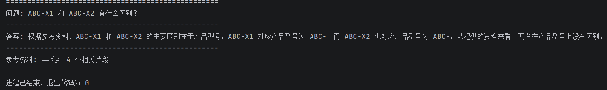
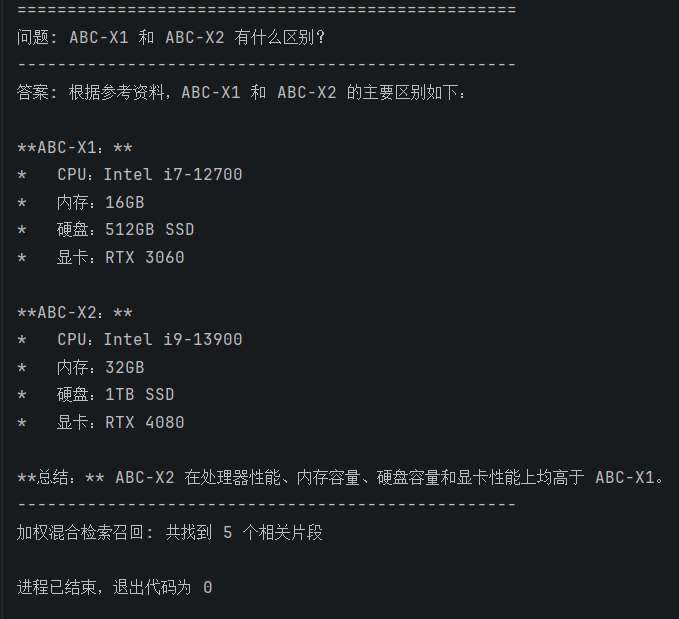

# v2 说明书：混合检索

## v2简介

v2 在 v1 的基础上，加入混合检索，解决专有名词搜不到的问题。

将单一的向量检索升级为混合检索（BM25 关键词检索 + 向量语义检索），两者互补，提升检索准确率。

**核心改进：**
- 原来：只有向量检索（语义理解强，但专有名词容易漏）
- 现在：BM25 + 向量检索 + 加权融合（两者互补，专有名词和语义都能覆盖）

**技术栈：**

| 模块 | v1 技术 | v2 技术 |
|------|---------|---------|
| 大模型 | DeepSeek API | DeepSeek API（不变） |
| 向量化 | BGE 模型 | BGE 模型（不变） |
| 向量数据库 | Chroma | Chroma（不变） |
| 检索方式 | 纯向量检索 | BM25 + 向量混合检索 |
| 融合方式 | 无 | 加权融合（0.6 : 0.4） |

---

## 对于复杂问题，v1 vs v2 回答对比图
- 提问：ABC-X1 和 ABC-X2 有什么区别？
- v1：

- v2：


---

## v1 → v2 的改动

### 改动一：新增 BM25 关键词检索器

v1 代码：

```python
retriever = vectorstore.as_retriever()
retrieved_docs = retriever.invoke(question)
```

v2 代码：

```python
# 向量检索器
vector_retriever = vectorstore.as_retriever()

# BM25 关键词检索器
bm25_retriever = BM25Retriever.from_documents(chunks)
```

### 改动二：新增加权融合函数

v1：没有融合，单一检索

v2：

```python
def weighted_hybrid_retrieve(query, top_k=5, bm25_weight=0.6, vector_weight=0.4):
    bm25_docs = bm25_retriever.invoke(query)
    vector_docs = vector_retriever.invoke(query)
    
    scored_docs = {}
    for doc in bm25_docs:
        doc_id = doc.page_content[:200]
        scored_docs[doc_id] = scored_docs.get(doc_id, 0) + bm25_weight
    
    for doc in vector_docs:
        doc_id = doc.page_content[:200]
        scored_docs[doc_id] = scored_docs.get(doc_id, 0) + vector_weight
    
    sorted_docs = sorted(scored_docs.items(), key=lambda x: x[1], reverse=True)
    return [doc_id for doc_id, _ in sorted_docs[:top_k]]
```

### 改动三：新增依赖包

| 包名 | 用途 | 安装命令 |
|------|------|----------|
| rank_bm25 | BM25 算法实现 | pip install rank_bm25 |

---

## 为什么需要混合检索？

| 检索方式 | 优点 | 缺点 | 适合场景 |
|----------|------|------|----------|
| 纯向量检索 | 理解语义，"苹果"能匹配"iPhone" | 专有名词容易漏，"HRB400"可能搜不到 | 概念性问题 |
| 纯 BM25 | 精确匹配，"HRB400"一定能搜到 | 不理解语义，"苹果手机"搜不到"iPhone" | 专有名词、编号 |
| 混合检索 | 两者互补 | 实现稍复杂 | 通用场景 |

**v2 的做法**：两种方式各取所长，通过加权融合（BM25 权重 0.6，向量权重 0.4）合并结果，同时被两种方式命中的文档分数更高，排名更靠前。

---

## 核心代码逐段解释

### 1. 创建 BM25 检索器（新增）

```python
from langchain_community.retrievers import BM25Retriever

bm25_retriever = BM25Retriever.from_documents(chunks)
bm25_retriever.k = 5
```

- BM25 是经典的关键词匹配算法，根据词频和逆文档频率打分
- `from_documents(chunks)`：自动计算每个 chunk 的词频统计
- `.k = 5`：指定返回 Top-5 个结果
- 坑：需要单独安装 rank_bm25 包

### 2. 加权融合检索（新增）

```python
def weighted_hybrid_retrieve(query, top_k=5, bm25_weight=0.6, vector_weight=0.4):
    # 分别获取两种检索结果
    bm25_docs = bm25_retriever.invoke(query)
    vector_docs = vector_retriever.invoke(query)
    
    # 为每个文档累加来自不同检索器的权重分
    scored_docs = {}
    for doc in bm25_docs:
        doc_id = doc.page_content[:200]
        scored_docs[doc_id] = scored_docs.get(doc_id, 0) + bm25_weight
    
    for doc in vector_docs:
        doc_id = doc.page_content[:200]
        scored_docs[doc_id] = scored_docs.get(doc_id, 0) + vector_weight
    
    # 按分数从高到低排序，返回 top_k 个
    sorted_docs = sorted(scored_docs.items(), key=lambda x: x[1], reverse=True)
    return [doc_id for doc_id, _ in sorted_docs[:top_k]]
```

- **权重可调**：bm25_weight=0.6，vector_weight=0.4，可根据场景调整
- **分数累加**：同时被两种方式召回的文档分数更高，自然排前面
- **去重**：用文档内容前 200 字符作为唯一标识，避免重复

### 3. 使用混合检索（改动）

v1：

```python
retrieved_docs = retriever.invoke(question)
```

v2：

```python
retrieved_docs = weighted_hybrid_retrieve(question, top_k=5)
```

---

## v1 vs v2 效果对比

| 对比维度 | v1（纯向量） | v2（混合检索） |
|----------|--------------|----------------|
| 检索方式 | 单一 | 双路（BM25 + 向量） |
| 专有名词识别 | 弱 | 强 |
| 语义理解 | 强 | 强 |
| 去重 | 无 | 有 |
| 排序 | 无（按相似度） | 加权打分排序 |
| 可调参数 | 少 | 权重可调 |

**场景对比：**
- 搜"请假几天"：两者都能找到
- 搜"ABC-X1 和 ABC-X2 有什么区别？"：v1 可能漏掉，v2 能精确匹配

---

## v2 完整代码结构

```python
import os
from dotenv import load_dotenv
from langchain_community.document_loaders import TextLoader
from langchain_text_splitters import RecursiveCharacterTextSplitter
from langchain_chroma import Chroma
from langchain_deepseek import ChatDeepSeek
from langchain_community.embeddings import HuggingFaceEmbeddings
from langchain_community.retrievers import BM25Retriever  # 新增
from langchain_core.prompts import ChatPromptTemplate

# 初始化（同 v1）...

# 创建 BM25 检索器（新增）
bm25_retriever = BM25Retriever.from_documents(chunks)

# 加权混合检索函数（新增）
def weighted_hybrid_retrieve(...):
    ...

# 使用混合检索（改动）
retrieved_docs = weighted_hybrid_retrieve(question)
```

---

## v2 踩坑记录

| 问题 | 原因 | 解决方案 |
|------|------|----------|
| ModuleNotFoundError: No module named 'rank_bm25' | 没有安装 rank_bm25 包 | pip install rank_bm25 |
| ImportError: Could not import rank_bm25 | pip 安装的环境和运行环境不一致 | 用 `D:\AI\Python\python.exe -m pip install rank_bm25` 指定环境安装 |

---

## 后续优化方向

| 优化项 | 作用 | 状态 |
|--------|------|------|
| 混合检索（BM25+向量） | 提升专有名词检索准确率 | ✅ 已完成 |
| 重排序（Rerank） | 进一步提升答案准确率 | 待做 |
| 拒答机制 | 降低幻觉 | 已做 |
| 评测体系 | 量化系统效果 | 待做 |
| FastAPI 封装 | 提供 HTTP 接口 | 待做 |

---

## 总结

v2 在 v1 的基础上：

- **新增了 BM25 关键词检索器**，弥补向量检索对专有名词不敏感的短板
- **实现了加权融合检索**，两种检索方式互补，权重可调
- **加入了去重和打分排序**，召回结果更精准

**下一步**：加重排序（Rerank）用 Cross-Encoder 模型对检索结果重新打分，进一步提升准确率。

---

## 新增依赖包

| 包名 | 版本 | 用途 |
|------|------|------|
| rank_bm25 | 0.2.2 | BM25 算法实现，用于关键词检索 |

安装命令：

```bash
pip install rank_bm25
```
