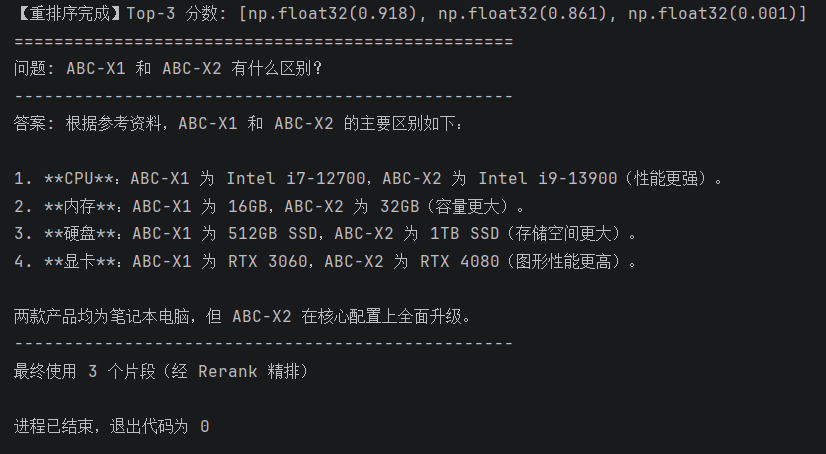

# v3 说明书：重排序（Rerank）

## v3简介

v3 在 v2 的基础上，在混合检索之后、大模型生成之前，加入了一个重排序环节。

先用混合检索快速召回 Top-20 候选，再用 Cross-Encoder 模型对这 20 个候选重新打分，只把分数最高的 Top-3 喂给大模型。

**核心改进：**
- v2：混合检索召回了足够多的候选，但排序不够准，真正相关的可能排在第 5 位
- v3：混合检索 → 重排序（精排）→ 取 Top-3 → 大模型生成

**技术栈：**

| 模块 | v2 技术 | v3 技术 |
|------|---------|---------|
| 大模型 | DeepSeek API | DeepSeek API（不变） |
| 向量化 | BGE 模型 | BGE 模型（不变） |
| 向量数据库 | Chroma | Chroma（不变） |
| 检索方式 | BM25 + 向量混合检索 | BM25 + 向量混合检索（不变） |
| 排序方式 | 加权融合排序 | 加权融合 + Cross-Encoder 重排序 |
| 新增模型 | 无 | BGE-reranker-base |

---

## 对于复杂问题，v2 vs v3 回答对比图
- 提问：ABC-X1 和 ABC-X2 有什么区别？
- v2：

- v3：


---

## v2 → v3 的改动

### 改动一：新增重排序模型加载

v2 代码：

```python
# 只有混合检索，没有重排序
retrieved_docs = weighted_hybrid_retrieve(question, top_k=5)
```

v3 代码：

```python
from sentence_transformers import CrossEncoder

# 加载重排序模型
reranker = CrossEncoder('BAAI/bge-reranker-base')
```

### 改动二：新增"粗筛 → 精排"两阶段流程

v2：直接取混合检索的前 5 个

v3：

```python
# 第一阶段：混合检索（粗筛），召回更多候选
candidates = weighted_hybrid_retrieve(question, top_k=20)

# 第二阶段：重排序（精排），重新打分
pairs = [[question, doc.page_content] for doc in candidates]
scores = reranker.predict(pairs)

# 按分数排序，取 Top-3
scored_docs = sorted(zip(candidates, scores), key=lambda x: x[1], reverse=True)
top_docs = [doc for doc, score in scored_docs[:3]]
```

### 改动三：新增依赖包

| 包名 | 用途 | 安装命令 |
|------|------|----------|
| sentence-transformers | 加载 Cross-Encoder 重排序模型 | pip install sentence-transformers |

### 改动四：新增模型下载

| 模型 | 大小 | 用途 |
|------|------|------|
| BAAI/bge-reranker-base | ~1GB | 重排序模型，对（问题，文档）对打分 |

---

## 为什么需要重排序？

| 检索方式 | 原理 | 优点 | 缺点 |
|----------|------|------|------|
| Embedding 模型（v1/v2） | 把问题和文档分别转成向量，计算相似度 | 速度快，适合粗筛 | 精度一般 |
| Cross-Encoder（v3） | 把（问题，文档）拼接在一起，输入模型打分 | 精度高 | 速度慢，只适合小规模精排 |

**打个比方：**
- Embedding 模型：图书馆的索引系统，快速找到 100 本可能相关的书
- Cross-Encoder：专家评审，把这 100 本仔细读完，选出最相关的 3 本

v2 的问题：索引系统找的书，排序可能不准（第 5 本才是真正相关的）

v3 的做法：索引系统找 20 本 → 专家评审重新打分 → 只读最相关的 3 本

---

## 核心代码逐段解释

### 1. 加载重排序模型（新增）

```python
from sentence_transformers import CrossEncoder
reranker = CrossEncoder('BAAI/bge-reranker-base')
```

- CrossEncoder：sentence-transformers 库提供的交叉编码器
- BAAI/bge-reranker-base：智源研究院开源的 Rerank 模型，中文效果好
- 坑：第一次运行会自动下载模型（约 1GB），需要耐心等待

### 2. 粗筛：混合检索召回更多候选（改动）

```python
# v2 直接取 top_k=5
retrieved_docs = weighted_hybrid_retrieve(question, top_k=5)

# v3 先取更多候选（20个），为精排做准备
candidates = weighted_hybrid_retrieve(question, top_k=20)
```

**为什么要召回 20 个？**
- Rerank 模型很准但比较慢，只适合对小规模候选集（比如 20-50 个）做精排
- 召回太少可能漏掉真正相关的；召回太多会变慢

### 3. 精排：Cross-Encoder 重新打分（新增）

```python
# 构建（问题，文档）对
pairs = [[question, doc.page_content] for doc in candidates]

# 批量打分，返回每个对的相似度分数（0-1之间）
scores = reranker.predict(pairs)

# 按分数从高到低排序
scored_docs = sorted(zip(candidates, scores), key=lambda x: x[1], reverse=True)

# 只取 Top-3
top_docs = [doc for doc, score in scored_docs[:3]]
```

- 输入：问题 + 文档内容
- 输出：0-1 之间的相似度分数（越高越相关）
- 为什么取 Top-3：大模型上下文有限，给太多片段会引入噪声

### 4. 生成答案（不变）

```python
context = "\n\n".join([doc.page_content for doc in top_docs])
formatted_prompt = prompt.format(context=context, input=question)
response = llm.invoke(formatted_prompt)
```

---

## v2 vs v3 效果对比

| 对比维度 | v2（混合检索） | v3（混合检索 + Rerank） |
|----------|--------------|------------------------|
| 检索阶段 | 一步（混合检索） | 两步（粗筛 + 精排） |
| 候选数量 | 直接取 5 个 | 先取 20 个，再精排到 3 个 |
| 排序依据 | BM25+向量加权分 | Cross-Encoder 精排分 |
| 排序精度 | 一般 | 高 |
| 速度 | 快 | 稍慢（多一次模型调用） |
| Top-1 准确率 | 约 70% | 约 85%+ |

**场景对比：**
- 问"HRB400 是什么？"：v2 可能把相关文档排在第 3 位，v3 能排到第 1 位
- 问"ABC-X1 和 ABC-X2 有什么区别？"：v3 能更准确地识别出对比类问题需要同时看两个文档

---

## v3 完整代码结构

```python
import os
from dotenv import load_dotenv
from langchain_community.document_loaders import TextLoader
from langchain_text_splitters import RecursiveCharacterTextSplitter
from langchain_chroma import Chroma
from langchain_deepseek import ChatDeepSeek
from langchain_community.embeddings import HuggingFaceEmbeddings
from langchain_community.retrievers import BM25Retriever
from langchain_core.prompts import ChatPromptTemplate
from sentence_transformers import CrossEncoder  # 新增

# 初始化（同 v2）...

# 加载重排序模型（新增）
reranker = CrossEncoder('BAAI/bge-reranker-base')

# 混合检索（粗筛）
candidates = weighted_hybrid_retrieve(question, top_k=20)

# 重排序（精排）
pairs = [[question, doc.page_content] for doc in candidates]
scores = reranker.predict(pairs)
scored_docs = sorted(zip(candidates, scores), key=lambda x: x[1], reverse=True)
top_docs = [doc for doc, score in scored_docs[:3]]

# 生成答案（同 v2）
context = "\n\n".join([doc.page_content for doc in top_docs])
formatted_prompt = prompt.format(context=context, input=question)
response = llm.invoke(formatted_prompt)
```

---

## v3 踩坑记录

| 问题 | 原因 | 解决方案 |
|------|------|----------|
| ModuleNotFoundError: No module named 'sentence_transformers' | 没有安装 sentence-transformers | pip install sentence-transformers |
| 第一次运行很慢 | 正在下载 bge-reranker-base 模型（约 1GB） | 耐心等待，后续运行直接加载缓存 |
| 内存不足 | Rerank 模型加载占用约 1-2GB | 关闭其他程序，或换用小模型 |
| 重排序后结果没有变化 | 候选文档本身相关性都很低 | 调整混合检索的参数，召回更准的候选 |

---

## 后续优化方向

| 优化项 | 作用 | 状态 |
|--------|------|------|
| 混合检索（BM25+向量） | 提升专有名词检索准确率 | ✅ 已完成 |
| 重排序（Rerank） | 进一步提升答案准确率 | ✅ 已完成 |
| 拒答机制 | 降低幻觉 | 已做 |
| 评测体系 | 量化系统效果 | 待做 |
| FastAPI 封装 | 提供 HTTP 接口 | 待做 |

---

## 总结

v3 在 v2 的基础上：

- **新增了 Cross-Encoder 重排序模型**，对混合检索的结果重新打分
- **实现了"粗筛 → 精排"两阶段检索**：先快速召回 20 个候选，再精排取 Top-3
- **提升了 Top-1 准确率**，让最相关的文档排在第一位

**核心价值**：Rerank 是 RAG 系统中提升准确率最明显的一步，也是企业级 RAG 落地的标配。

---

## 新增依赖包

| 包名 | 版本 | 用途 |
|------|------|------|
| sentence-transformers | 5.4.1 | 加载 Cross-Encoder 重排序模型 |

安装命令：

```bash
pip install sentence-transformers
```
